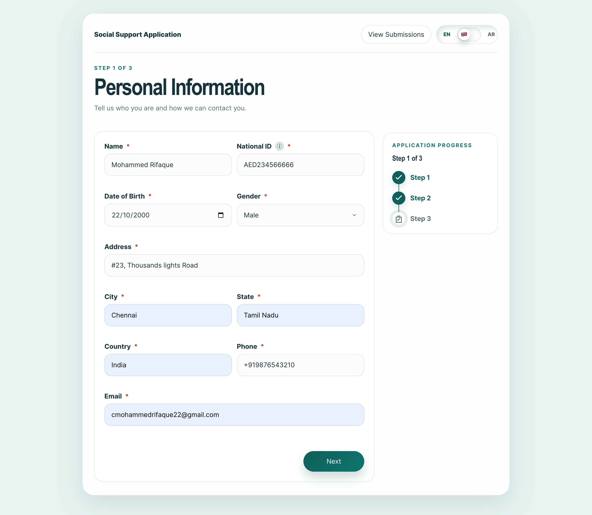
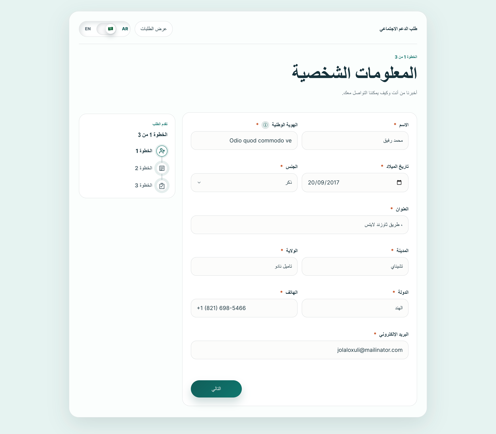
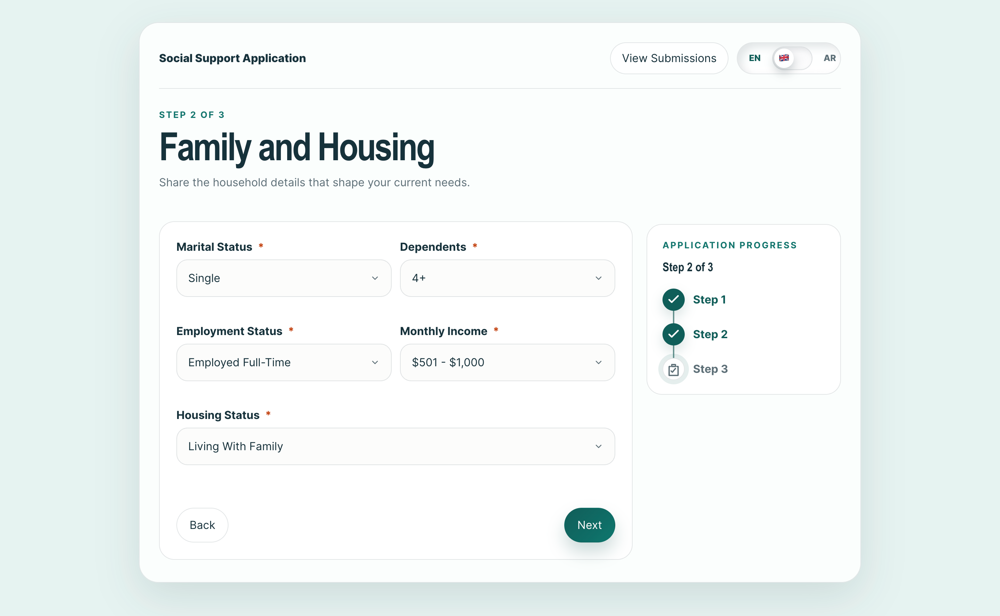
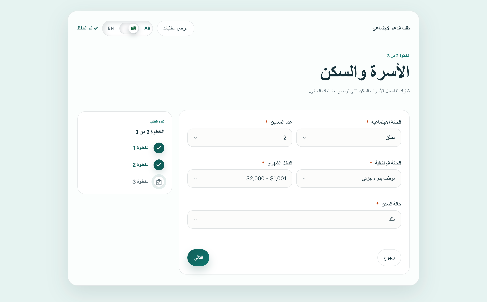
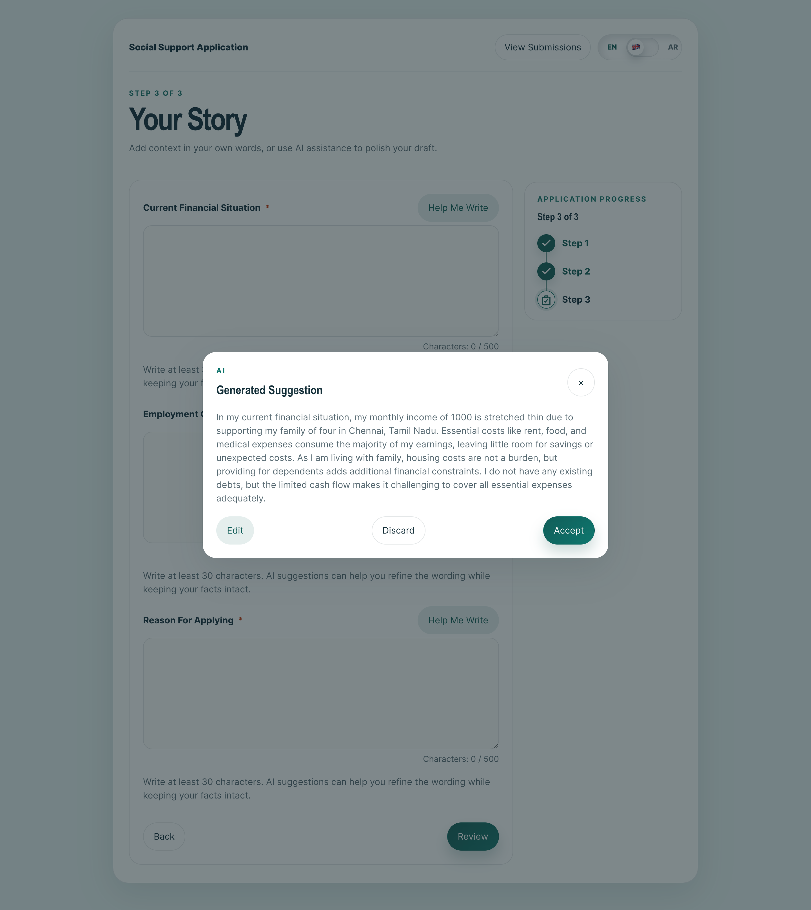
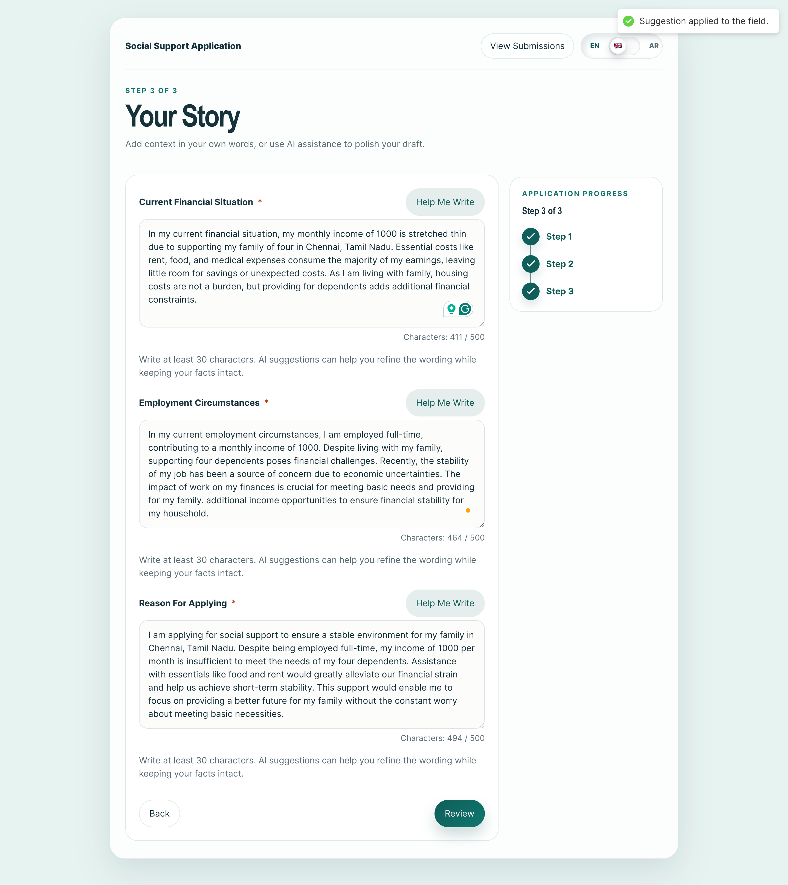
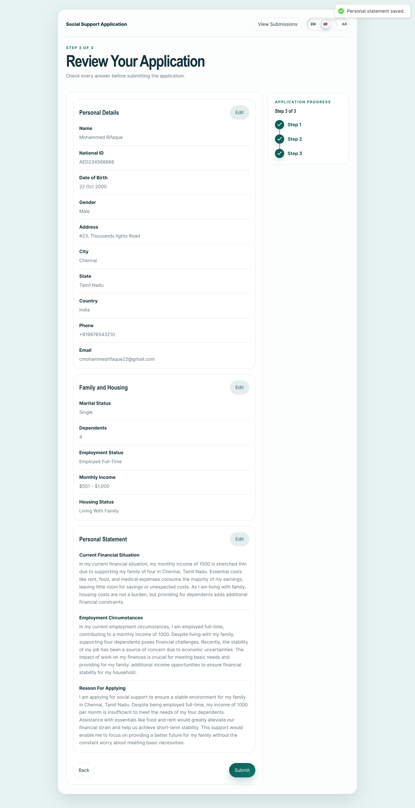
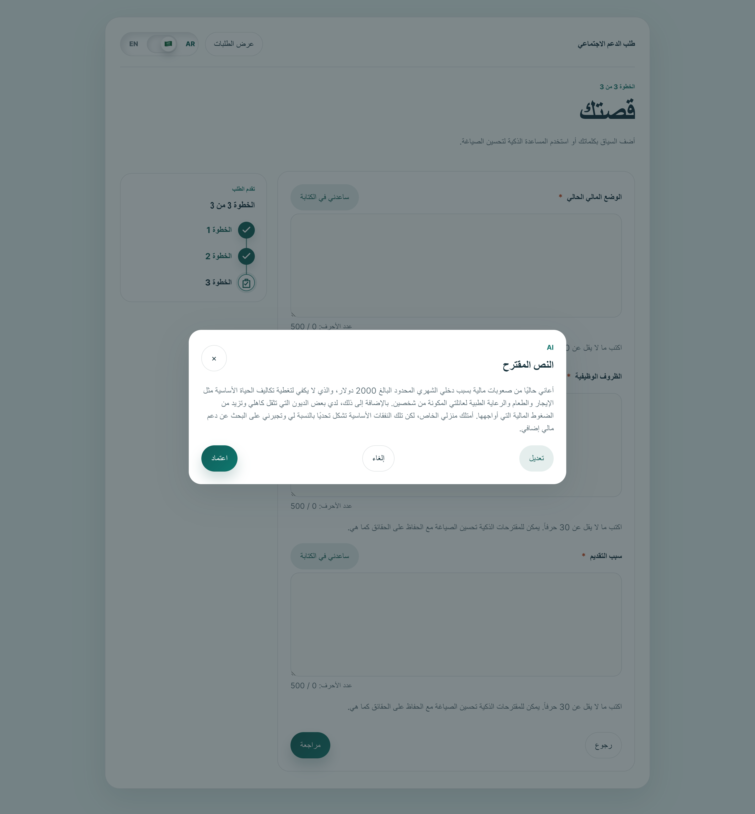
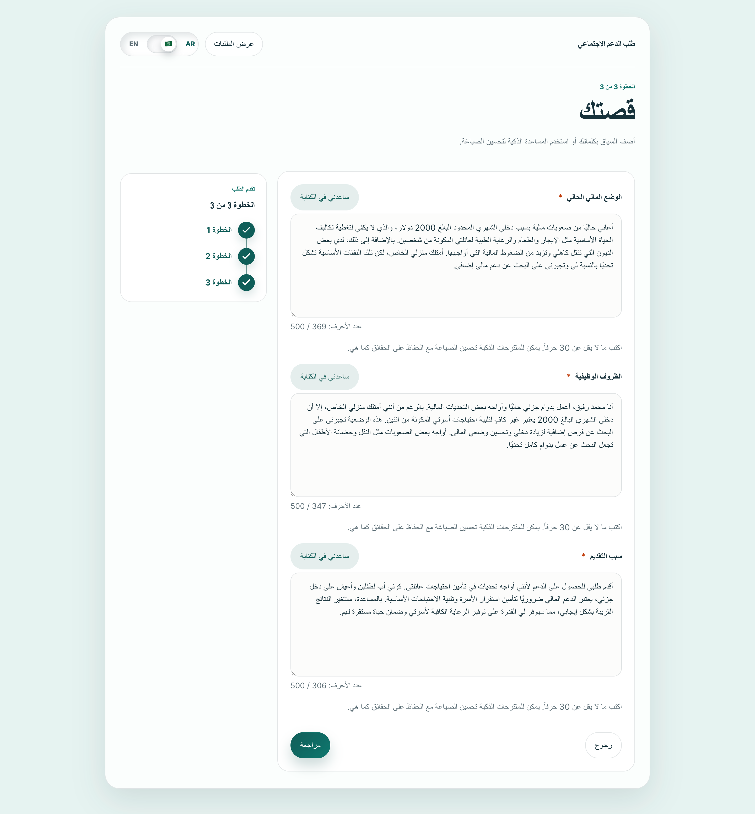

# Social Support App

## Assignment Highlights

- React + TypeScript + Vite
- React Hook Form + Zod validation
- Multi-step application wizard with progress tracking
- English & Arabic localization with RTL support
- OpenAI-powered writing assistance
- LocalStorage persistence and autosave
- Accessible keyboard navigation and ARIA support
- Responsive design for mobile, tablet, and desktop

## Project Overview

This project is a multi-step social support application built as part of the Front-End Case Study. It allows applicants to submit personal, financial, and situational information through a guided workflow, with AI-assisted support for narrative responses.

## Screenshots

### Step 1 - Personal Information





### Step 2 - Family & Financial Information





### Step 3 - Situation Descriptions











## Features

- Multi-step form wizard with route-based navigation
- Form validation using React Hook Form and Zod
- AI-powered writing assistance for narrative fields
- Suggestion modal with Accept, Edit, and Discard actions
- Local autosave with persistence status indicator
- English and Arabic language support with RTL layout
- Responsive design across mobile, tablet, and desktop
- Accessible form controls and keyboard navigation
- Review and mock submission workflow

## Tech Stack

- React
- TypeScript
- Vite
- React Router
- React Hook Form
- Zod
- OpenAI API
- i18next

## Setup

### Install dependencies

```bash
npm install
```

### Configure environment variables

```bash
cp .env.example .env
```

Add your OpenAI API key:

```env
VITE_OPENAI_API_KEY=your_openai_api_key
```

### Run development server

```bash
npm run dev
```

### Build production bundle

```bash
npm run build
```

## AI Integration

The AI writing assistant is available in Step 3 for:

- Current Financial Situation
- Employment Circumstances
- Reason for Applying

Implementation details:

- Endpoint: `https://api.openai.com/v1/chat/completions`
- Model: `gpt-3.5-turbo`
- Error handling for failed requests and timeouts
- Loading states during content generation

> Note: For production systems, OpenAI requests should be routed through a backend service to prevent exposing API credentials.

## Architecture

```text
src/
├── components/
├── context/
├── hooks/
├── locales/
├── pages/
├── routes/
├── schemas/
├── services/
└── types/
```

## Future Improvements

- Secure backend proxy for AI requests
- Automated unit and integration testing
- Field masking for sensitive inputs
- Submission history and audit trail
- CI/CD pipeline
- Enhanced accessibility audits

## Author

Mohammed Rifaque
